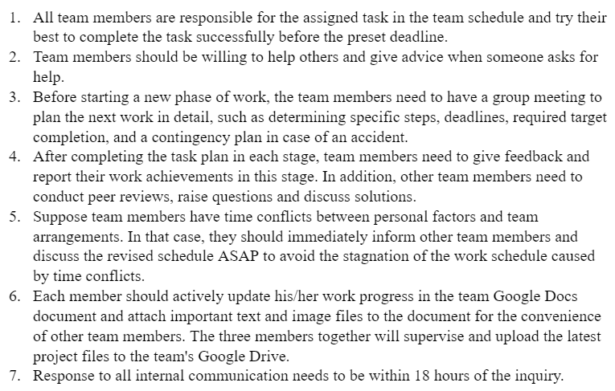

# ECE 445 Lab Notebook

## 02/10

### Pressure and Sound Sensor 
We carefully considered various options for each subsystem and determined that our pressure sensors should withstand a maximum force of approximately 50 N. After thorough research, we ultimately chose the SEN0294 pressure sensor due to its ability to measure up to 60 N of force. Our team deliberated extensively over which sound sensor to use, as we wanted to select one with a sound pressure level threshold as close to 110 dB as possible.

## Ultrasonic Sensor 
HC-SR04 and HC-SR05 are both designed for distance measurement. However, they are a bit differ in aspects such as operating frequency, which makes the difference in accuracy and response time. Compared to HC-SR05, HC-SR04 operates at a higher frequency of 40kHz, providing higher accuracy. Additionally, HC-SR04 has a shorter response time and can complete a operating cycle in 10 microseconds, while HC-SR05 requires around 58 milliseconds. 

## 02/15

## Connection to Program the Board
I read the document of ATMega328P(https://www.farnell.com/datasheets/74880.pdf). It is wise to use SPI for programming interface. ATMega328P is an 8-bit microcontroller widely used in embedded systems. Through the SPI interface, it can communicate with other devices, such as sensors and displays. The SPI interface uses four signal lines, namely MOSI (Master Output Slave Input), MISO (Master Input Slave Output), SCK (Clock), and CS (Chip Select). In ATMega328P, MOSI and MISO correspond to the output and input data pins. Besides, SCK provides the clock signal, and CS helps select the communication device. 

## 02/17

## Connection to Program the Board (Continue)
After carefully reading the document, I determine to use the interface protocol UART, which uses two signal lines, TX (Transmit) and RX (Receive) for serial communication. In ATMega328P, TX and RX correspond to the output and input data pins. 

## 02/18

## MCU Choice + Pin Connection Check
1. How the output of the sensor be suitable for the MCU? Voltage range? Duration?
2. What are the appropriate resistor/capacitor? Tolerance range
3. What is the clock cycle to burn the code onto the board?   

## Completion progress: 
1. Used the SPI interface to program.
2. Specified the wanted PCB must have MOSI, MISO, and SCK function. ATMega328P fits our requirement. Link of datasheet: https://content.arduino.cc/assets/Atmel-7810-Automotive-Microcontrollers-ATmega328P_Datasheet.pdf
3. The operating voltage range: 2.6 V (±0.1V) to 5.4 V (±0.1V)
4. The operating frequency for ATmega328 is 8MHz, which is acceptable for this project. 

## 02/19

## Team Contract(Responsible for the primary drafting of this document)
Our team determine to keep effective communication and collaboration to maintain a good track on the project for the final success. We have set up regular meetings every Monday afternoon and plan other meetings flexibly based on our progress. During these meetings, we will discuss specific tasks and deadlines, share progress updates, and offer feedback to each other.

Moreover, we have established a public document to keep track of our schedules, tasks, and progress. This document helps us to stay organized and open to ideas and ensures that everyone is on the same page. If a member needs assistance or is facing any difficulties,  we can discuss and solve any issues together. Our goal is to work cohesively and efficiently while supporting and encouraging each other throughout the process.      

{width=40% height=20%}

## 02/23

## Reading the SPI Protocol Documents
I looked over some websites and Youtube videos to learn about AVR microcontrollers and the SPI communication protocol.

1. Basic concepts of the SPI communication protocol: SPI (Serial Peripheral Interface) is a serial communication protocol used for communication between microcontrollers and external devices.
2. The master-slave device concept in SPI: The SPI communication protocol has one master device and one or more slave devices, with the master device responsible for controlling the communication process.
3. Four signal lines of SPI: MOSI (Master Out Slave In), MISO (Master In Slave Out), SCK (Serial Clock), and SS (Slave Select).
4. AVR microcontroller's SPI module: Learn how the AVR microcontroller implements SPI communication functions and understand the roles and configuration methods of its internal registers.
5. Example codes for SPI communication, including configuring SPI registers and methods for sending and receiving data.

## 02/27

## PCB Sensor Modification
I redesigned the arrangement of 15 pressure sensors on the PCB. I designed that the 15 sensors would be arranged in three rows and five columns. Within the same row, each column would be connected in parallel and then each one will also be connected in series to a resistor to ensure that there is no excessive current flow, which may cause a short circuit. Additionally, the five sensors in each row would be connected in series with an NMOS to control the switch for the pressure sensor measurement function. By doing this, we can reduce the number of analog pins required on the MCU.

(Updated on 4/26) We have considered the impact of the high-frequency switching signal caused by the NMOS on the low-frequency signal of the pressure sensor itself. However, in the actual verification process, the interference was not significant, so it is within an acceptable range.

## Tips
It should be noted that the logic of these NMOS is to read the readings of all sensors in the array at high. Therefore, the readings of five sensors in each row will be read at the same time. Therefore, it is necessary to carefully read the data in the right order to avoid recording wrong sensor data.         

{width=40% height=20%}

## 03/03

## Prototype Sensors On Breadboard (Pressure Sensor in 3*3)

This week, I received the first batch of pressure sensors and began conducting related tests on a breadboard. Since there were less than 15 sensors, I temporarily set up a small-scale test with a 3x3 grid. I connected the pressure sensors to the Arduino Uno according to the PCB schematic and attempted to apply pressure to multiple sensors simultaneously to observe the readings reflected in the Arduino IDE terminal. Meanwhile, I also started writing code for the pressure sensor data evaluation, allowing the MCU to print a preset alarm message when it detects more than 5N of force on multiple pressure sensors simultaneously. The result was that the prototype successfully achieved the desired outcome during the small-scale breadboarding test.

## 03/06

## Prototype Sensors On Breadboard (Add Ultrasonic Sensor) 
I plan to complete the Pressure Sensor, Ultrasounic Sensor, and Sound Sensor prototyping, splice the basic circuit on the breadboard, and code corresponding driver on the Arduino IDE.

For the pressure Sensor, the increase of pressure will lead to the decrease of resistance, so it is quantified as a value in the range of 1-1024 in IDE. By building a 3*5 matrix, we add judgment statements. Every time the value of a sensor in the matrix changes to a value less than 900 after each loop delay, the count increments by 1. Then, if the current count value is greater than 4, it can be used to judge that the baby is crawling. For ultrasounic Sensor, I let the program detect the difference between the two return times of echopin, multiply by the speed of the sound and divide by two to get the distance data. Finally, whether the distance is less than the length of crib is detected to determine whether the baby triggers the alarm. The sound sensor returns a voltage data, so I wrote the code to detect and calculate the difference of it between loops and match that to the range between 1-1024, the higher than volume is, the larger the value is. Once the value is higher than 58, it will set a preset variable to true and trigger the alarm.

{width=40% height=20%}
{width=40% height=20%}

## 03/13

## Preliminary Setup of the Pressure Sensor on the Breadboard
I preliminarily completed the layout and wiring of the pressure sensor on the breadboard and conducted an initial test by connecting it to the Arduino UNO. It was verified that the pressure sensor could successfully measure results. However, there were still some issues. As the individual pressure sensor was a thin sheet, its sensitivity to pressure changes was compromised due to its thinness and the pressure applied on it being dispersed by the tabletop it was on.

{width=40% height=20%}

## 03/16

## Preliminary Setup of the Ultrasonic Sensor on the Breadboard
I conducted testing on the ultrasonic sensor, and it was detected that due to the HC-SR04's Effectual Angle being approximately 15 degrees, caution needs to be taken when arranging the sensors to ensure they are not too close together. Additionally, I also observed some strange phenomena, where obstruction in front of the ultrasonic sensor in position 4 would trigger an alarm in position 2. Furthermore, sometimes, the alarm trigger probability is unstable when an object is placed at the threshold distance set in the program. I believe this is due to the microphone of the sensor emitting sound waves that are too scattered.

## 03/20

## Integrate Sensors Prototype
I have started and complete partially on the integration of the Sensor Prototype. I want to test whether the program can simultaneously process the input data of multiple sensors. Also use a 3-bit array to represent all eight cases, including the trigger/not trigger cases for three sensors. It makes convenience for the data transmission through Bluetooth later in the project. 

I asked the program to output a variable for each sensor based on the trigger criteria we previously set for each sensor. If the corresponding condition is triggered, bitSet the value to 1, otherwise bitClear the value back to zero. Each sensor occupies one bit of code, so the three sensors correspond to three bits of code, which are 2\*2\*2 = 8 cases in total. Therefore, the receiving end can recognize the corresponding case after receiving the Bluetooth signal.

| Ultrasonic    | Pressure      | Sound             | Readings          |
| --------------| --------------| ------------------| ------------------|
| 0             | 0             | 0                 | Read as case 0    |
| 1             | 0             | 0                 | Read as case 1    |
| 0             | 1             | 0                 | Read as case 2    |
| 1             | 1             | 0                 | Read as case 3    |
| 0             | 0             | 1                 | Read as case 4    |
| 1             | 0             | 1                 | Read as case 5    |
| 0             | 1             | 1                 | Read as case 6    | 
| 1             | 1             | 1                 | Read as case 7    |

## 03/25

## Modification on Crib Model -- Large Paper Box
I made some modifications to the crib model, which is a paper box that fits the dimensions described in our design document. In order to ensure that the ultrasonic sensor array can cover all areas of the short side of the crib, I reduced the distance between the two middle sensors from 15cm to 10cm, which ensured full coverage of the scan, and duplicate areas will obtain data from two sensors that can be used to verify the data.

I cut the paper box according to the style of the baby crib, cut off the top surface, and then taped one of the openings on both sides, leaving the other opening for easy installation of the pressure sensor matrix and necessary adjustments. Then, together with Yuhao, we accurately marked the installation positions of each pressure sensor on the bottom edge of the paper box, for easy installation later. I also marked the installation positions of the subsequent circuit case and ultrasonic sensors on the outer wall of the paper box.

{width=40% height=20%}

## Issue on Sound Sensor
Upon testing the sound sensor, we discovered some unexpected issues. When there is no noise in the nearby environment, the digital output continuously returns a value of "1," and the analog output returns around 60. We have identified this as a malfunction in the sensor. We may need to buy a brand-new sound sensor or adjust the if statement in the code. 

## 03/28

## Installation of Pressure Sensor & Crib Surface Polishing  
Since Dushyant did not know we had two PCBs, the timing of the order was delayed. As a result, we cannot perform soldering on the crib PCB at this stage. Therefore, I decided to start building our crib model, which is the cardboard box previously mentioned. To address the sensitivity issue with the pressure sensor mentioned before, and combining with Xinlong's idea, we obtained 15 cylindrical pieces of wood from the machine shop, each with a height of 10mm, a diameter of 16mm, and a total weight-bearing capacity of at least 6.8Kg. I attached these cylindrical pieces to the plastic film surface of the pressure sensor with double-sided tape, making them at a different height level from the crib's bottom cardboard. Therefore, the force applied on the objects above would be mainly concentrated on the plane of the cylindrical pieces, thereby transmitting the force to the pressure sensor and enhancing its sensitivity during actual operation. I plan to complete the bottom wiring and the wooden cylinder attachement of the pressure sensor within four days, as well as cut the box to make it closer to the shape of a real crib. Additionally, I adjusted the installation position of the ultrasonic sensor, added a back panel for fixing, and polished and adjusted the cardboard on both sides to ensure that there are no overly uneven parts.

As we are still testing the ultrasonic sensor on the breadboard and Xinlong wants to use this opportunity to test the monitor subsystem, I plan to install the remaining two types of sensors onto the crib in one week.

{width=40% height=20%}
{width=40% height=20%}

## 04/03

## Modification and Testing on the Bluetooth Data Transmission
After setting up all of the sensors, we performed a Bluetooth connection and communication test to confirm that the system could effectively collect and analyze data, and transmit information via Bluetooth. Following Xinlong's recommendation, we attempted to have the MCU and Bluetooth module send signals, containing a single letter from A to Z in each loop, transmitted in order. All of the packages were ultimately received successfully. Next, the two systems were tested by transmitting the analyzed byte information to the receiving end, where it was successfully printed on the display. We also tested the triggering of each sensor and arranged them in various combinations, with most combinations successfully displaying the corresponding text on the receiving end and triggering the corresponding buzzer.

However, it should be noted that during our testing of the pressure sensor, its performance was slightly subpar. The display often did not show any text, indicating that the alarm was either not sent via Bluetooth or was not triggered due to a mismatch in communication refresh cycles between the two systems. We reduced some of the delays and the threshold of the pressure sensor in the program, which resulted in a slight improvement, but further improvement is still needed.

## Not Showing "Crib signal not found" on Display
We have rectified a software glitch that prevented the "Crib signal not found" notification from appearing on the screen when there was no signal received from the Bluetooth. This issue is caused by an AND operation (avail_num == 0 && cur_time > last_msg_time + WAIT_MSG_TIME_OUT) in the code. It makes legal action to skip the return statement in the loop. These are the detailed explanantion: 

1. avail_num == 0: This condition checks if the number of available signals (avail_num) is equal to 0. A value of 0 indicates that no signal is being received.
2. cur_time > last_msg_time + WAIT_MSG_TIME_OUT: This condition checks if the current time (cur_time) is greater than the last time a message was received (last_msg_time) plus a predefined waiting timeout duration (WAIT_MSG_TIME_OUT). If the current time exceeds this calculated limit, it means that the maximum allowed time for waiting for a message has been surpassed.

The conditional expression uses a logical AND operator (&&), which requires both conditions to be satisfied in order to return true. If avail_num is 0 (no signal) and the current time has exceeded the allowed waiting time limit, the expression evaluates to true. This typically triggers a subsequent action, such as, in this context, causing the "Crib signal not found" notification to not be displayed when the expression is true. We changed the second statement scope to the subordinary scope of the first statement to fix this issue. 

## Inconsistencies in Pressure Sensor Performance
The pressure sensors are supposed to consistently deliver notifications indicating the baby's movements when any of them detects a change within a certain range. However, in some instances, notifications were triggered during both pressing down and release, while in others, they were only activated during one of the action, not both. There are even cases that no notifications were generated at all, which is in nearly 5% of the time. We initially attempted to rectify the issue by comparing the time difference between two readings, but this approach does not improve much. Likewise, averaging ten readings into a single measurement to avoid interference did not work well. Upon more detailed testing and analyzing, we decided not to care too much on this because the pressure sensor itself works and responds very fast and senstitive to the force change. Approximately 90% of the time, the pressure sensors provide accurate measurement data in a timely manner. 

## 04/06

## All Sensors Extended Lines Soldering
Xinlong and I went to 2070 to perform soldering on the pressure sensor and ultrasonic sensor since the preliminary testing on the breadboard was completed. We needed to add extension wires to connect the sensors to the PCB boxes installed on the cardboard box's sidewall. During the soldering process, we encountered a problem where the pin of the pressure sensor was very thin, resulting in hollow soldering points that would automatically come off after a while. We had to perform additional soldering a few times to fix this issue.

## 04/08

## Crib Physical Structure Build-up
The crib has been built and is considered mostly completed, with all three sets of sensors successfully installed. The pressure sensor is installed at the bottom of the cardboard box, with a layer of plastic film covering it to prevent any risk of electrical shock. On top of the sensor is a layer of mattress. The ultrasonic sensor is first installed on a piece of cardboard, then attached to the short side of the crib with adhesive, ensuring that the sensor is at a height of about 20 inches from the bottom. However, the sound sensor has not been installed yet since it needs to be installed in the crib's PCB box, which has not arrived from the machine shop yet.

I organized and routed the long wires of the pressure sensors according to my pre-planned layout, and then managed the wiring on the side walls of the crib cardboard box. Finally, I bundled the wires on the exterior of the longer side wall. Xinlong mentioned that he wanted to be responsible for connecting the wires to the PCB pins, so I handed that part over to him.

## 04/15

## Ultrasonic Sensor Issue
After installing the four ultrasonic sensors on the crib, we conducted tests on them. However, the results of this on-site test on the crib differed significantly from our previous tests on the breadboard. In simple terms, the sensors became extremely unstable. Sometimes they would trigger an alarm beyond the preset warning distance, while other times they remained unresponsive even when touching the microphone surface. We studied the issue for a long time, adjusted the code parameters, but it does not change its performance much. 

Eventually, we discovered that the ultrasonic sensors on the edges sometimes alarmed for objects placed outside the crib, which meant that the detection range of the ultrasonic waves was broader than we had imagined. A reasonable hypothesis was that the width and length of the microphone surface caused the ultrasonic waves to emit not from a single point, making the sound waves spread wider as they traveled, eventually reflecting off objects outside the originally anticipated range, causing detection errors and false alarms.

To address this issue, we devised a targeted solution. We cut A4 paper into strips, rolled them into tubes, and fitted them onto the ultrasonic sensors, allowing the sound waves emitted from the microphone to propagate through an extended channel. This measure effectively enhanced the directionality of the sound waves, significantly reducing the edge sound wave reflections influenced by surrounding objects, and consequently reducing false alarms and non-alarm occurrences.   

{width=20% height=10%}

## 04/17

## Ultrasonic Sensor Issue (Continue)
After several days of thinking, I proposed an alternative plan. Since we consider that the measurement errors were caused by the diffusion of ultrasonic waves and the cluttered reflections from the crib's four walls, we could install sound-absorbing materials on the two long sides and one short side to prevent the generation of scattered waves. Ultimately, we purchased dishwashing sponge cloths from the supermarket and placed them on the cardboard walls on all four sides. Due to the abundance of wires on the two long sides, we temporarily decided to apply the sponge cloths only to the opposite short side cardboard wall. The latest results showed an improvement in the performance of the ultrasonic sensors, eliminating most of the previous false alarms and non-alarm occurrences.

{width=20% height=10%}

## 04/22

## Ultrasonic Sensor Issue Reason -- Crosstalk?

During this process, we reflected on and recalled our previous experiments: When tested on the breadboard, the ultrasonic sensors worked perfectly fine, so we never anticipated any issues with this part in the crib model. Therefore, to identify the root cause of the problem, we must thoroughly analyze the differences between the breadboard and PCB environments to determine any critical factors that led to the issue.

The circuit board traces and clock speed were the most notable differences between testing on breadboard and in crib environment. Therefore, the can be a reasonable explanation to the ultrasonic sensor issue. One reason could be trace crosstalk between the data traces of US0 and 1. As we looked at the PCB layout, we think the crosstalk might even occur between the NMOS gate traces and US0,1,and 2, which means the pressure sensor is having some impact on the ultrasonic sensors. Although the signal sent out from the pressure sensor is low-frequency based. The high-frequency switching between high and low states of NMOS could create interference with other high and low-frequency signals. This problem was not observed or was rarely seen on the breadboard prototype because the development board is made by industrailized standard and the traces implemented were well-organized and nearly no crosstalk.

As I mentioned before on 03/28, the delay in ordering the PCB cost us two weeks that could have been used for debugging the PCB design. If we were to make any corrections in the next step, we might start by reconfiguring the PCB layout with a more reasonable wiring arrangement.

{width=60% height=30%}

## 04/25

## Final R/V Checkout
Before our upcoming demo, we conducted the final full-system R/V checkout. Here is a summary of the R/V of our Crib Subsystem.
The following text refers to "alarms" as displaying corresponding text information on the screen and the buzzer emitting a beep sound.

1. R: The ultrasonic sensor should inform the MCU if the baby reaches a height of 20 in ± 0.5 in from the bottom of the crib. 
   V: We have tested this by placing our hand at the mentioned height to check if the alarm is triggered.

2. R: The sound sensor should correctly report to the MCU when there is a sound above 86 dB measured at 34 in ± 1 in from the sensor. 
   V: We have verified this by placing a decibel meter and a sound source next to the sensor and checking if the monitor would trigger an alarm when the sound source plays a sound above 86 dB.

3. R: The pressure sensor array should correctly detect the change in the number and positions of the 15 pressure sensors that feel a perpendicular force greater than 5 N. 
   V: We have tested this by applying at least 5 N of pressure to each sensor and checking if the alarm is triggered during the process.

4. R:The microcontroller can process data from all sensors and generate informational data about the safety status in the crib at all times. 
   V: During the verification process of the first three steps, the alarms were triggered correctly. The triggering timing matched our settings, i.e., the sound sensor would alarm only after continuously receiving high volume for more than 2 seconds, while the pressure sensor would alarm only after detecting data that was different from the pressure readings 2 seconds ago. This duration helps avoid false alarms.

5. R: The microcontroller can deliver informational data to another device with its Bluetooth within 10 m and with at most three 11.4 cm or thicker walls in between. The time it takes to send the data should be within 3 seconds. 
   V: Throughout the test, we placed the monitor at least 10 m away from the crib and conducted tests with the monitor at the entrance of the suite and the crib in the innermost room.

## 04/26 

## Final Demo
Today, which is Monday, we completed our final demo and successfully met all of our high-level requirements. This is certainly worth celebrating, although it was expected. Unfortunately, we had to use a breadboard to demonstrate our ultrasonic sensors because a pin related to the sensor was burnt out on the PCB. To provide a complete record, here are all the high-level requirements:

1. Detect if the baby is about to climb out of the crib
2. Detect if the baby's crying sound exceeds a threshold of 86 dB and lasts for more than 2 seconds
3. Reliable communication must be established between the crib and the monitor. Specifically, the monitor can receive safety status messages from the sensor within 3 seconds when it is within 10 meters and 3 interior walls from the crib.

## Reference
[1] J. S. Allen, "What is the average penis size?," Medical News Today, Aug. 14, 2019. [Online]. Available: https://www.medicalnewstoday.com/articles/324728#average-lengths. [Accessed: February 3, 2023].

[2] "Ultrasonic Sensor HC-SR04 with Arduino," ElementzOnline, Oct. 12, 2017. [Online]. Available: https://www.elementzonline.com/blog/ultrasonic-sensor-hc-sr04-with-arduino. [Accessed: February 10, 2023].

[3] S. Williams, "Understanding the Basics of Ultrasonic Proximity Sensors," All About Circuits, Feb. 24, 2021. [Online]. Available: https://www.allaboutcircuits.com/industry-articles/understanding-the-basics-of-ultrasonic-proximity-sensors/. [Accessed: February 13, 2023].

[4] Atmel Corporation, "Automotive Microcontrollers ATmega328P Datasheet," 2015. [Online]. Available: https://content.arduino.cc/assets/Atmel-7810-Automotive-Microcontrollers-ATmega328P_Datasheet.pdf. [Accessed: February 15, 2023].

[5] R. H. James, "SPI Master/Slave Connections Between ATmega328P's," RJH Coding, Apr. 22, 2012. [Online]. Available: http://www.rjhcoding.com/avrc-spi.php. [Accessed: February 23, 2023].

[6] D. Stojanovic, "How to Configure and Pair Two HC-05 Bluetooth Module as Master-Slave Commands," HowToMechatronics, Dec. 22, 2016. [Online]. Available: https://howtomechatronics.com/tutorials/arduino/how-to-configure-pair-two-hc-05-bluetooth-module-master-slave-commands/. [Accessed: March 25, 2023].
